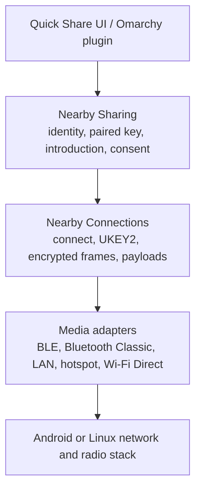

# Quick Share interoperability architecture and plan

Research date: 2026-09-04

## Decision

Do not add a notification or PIN-entry mechanism. Stock Android Quick Share starts
its receive prompt from the protocol exchange. The four-digit value is derived
from the UKEY2 authentication token and is compared on both devices; it is not
entered on the phone.

The current physical baseline is one inbound URL attempt on installed build
`34b9fe1` at `2026-09-05T08:49:35Z`. It completed handshake, pairing,
introduction, and local consent, then rejected encrypted
`BANDWIDTH_UPGRADE_RETRY` 12 as `unexpected_frame_type`. Public status reported
`disconnected` with 0 of 20 bytes transferred, but the trace showed no EOF or
explicit disconnect.

An independent Google-derived encrypted `FILE` retry reproduces that old-image
frame-12 rejection. Fresh code completes the exact inbound URL, Retry 12, and
keepalive sequence. The standalone outbound counterpart writes 20 of 20 bytes
and Google completes, but local state is `Failed` for a reason still under
investigation. A physical-phone rerun remains pending, and the proprietary
peer's internal cause remains unknown.

A 1,048,577-byte `FILE` passed integrity and chronology checks in both
directions with the Google-derived Linux peer. This is reference evidence, not
phone compatibility evidence.

This document complements the broader
[implementation baseline](research/implementation-baseline-2026-09.md),
[programmatic verification policy](research/bidirectional-programmatic-verification.md),
and [source-backed payload lifecycle audit](research/simulator-vs-android-paired-key.md).

## Scope and evidence rules

The target is local, account-free Quick Share in `Everyone` or explicit
`Receive` mode. Google-account trust, Contacts, Your devices, QR cloud sharing,
AirDrop interoperability, and NFC are separate protocols or trust modes.

Claims below use three evidence classes:

- **Public guarantee**: documented Android user behavior.
- **Reference behavior**: behavior in Google's pinned Apache-2.0 Nearby source.
  It is authoritative for the open implementation but is not a compatibility
  contract for the proprietary Android product.
- **Observed here**: current source, tests, or journal output from this machine.

Anything about the proprietary Android implementation beyond its documented UI
is unknown unless a black-box run establishes it.

## Canonical architecture

Quick Share is not one protocol. Nearby Sharing supplies advertisements,
trust/verification, attachment descriptions, consent, and transfer state.
Nearby Connections supplies endpoint connection, UKEY2, the encrypted D2D
channel, payload framing, keepalives, disconnects, and bandwidth upgrades.
Linux media adapters supply discovery and sockets.



The interfaces must remain layered:

1. The plugin issues local control commands and renders typed daemon state. It
   must not implement phone signaling or protocol timing.
2. The Sharing module owns the ordered sharing state machine.
3. The Connections module owns connection negotiation, UKEY2, encryption, and
   payload events.
4. Media adapters own only discovery, socket establishment, upgrade, fallback,
   and cleanup.

This is a deep-module split: protocol complexity remains behind the Sharing and
Connections interfaces instead of leaking into the plugin or platform adapters.

## Canonical account-free flow

| Stage                      | Sender                                                                                                                                                                                                                                                                                                                  | Receiver                                                                                                                                                                                            | Evidence                                                                                                                                                                                            |
| -------------------------- | ----------------------------------------------------------------------------------------------------------------------------------------------------------------------------------------------------------------------------------------------------------------------------------------------------------------------- | --------------------------------------------------------------------------------------------------------------------------------------------------------------------------------------------------- | --------------------------------------------------------------------------------------------------------------------------------------------------------------------------------------------------- |
| 1. Discovery/advertising   | Enters the share flow and searches for eligible endpoints.                                                                                                                                                                                                                                                              | Becomes publicly visible by opening `Receive` or selecting `Everyone for 10 minutes`. Only the receiving target needs public visibility for an account-free transfer.                               | Android Help says a missing target should be put in Receive mode and that Receive mode is visible to anyone nearby. Google's `Advertisement` includes a public device name for Everyone visibility. |
| 2. Endpoint connection     | Selects the advertised endpoint and opens the chosen medium.                                                                                                                                                                                                                                                            | Accepts the incoming Nearby Connections request.                                                                                                                                                    | Google Nearby `Core` and `NearbyConnectionsManagerImpl`.                                                                                                                                            |
| 3. Connections handshake   | Sends the connection request and takes the UKEY2 initiator role.                                                                                                                                                                                                                                                        | Answers the request and takes the UKEY2 responder role.                                                                                                                                             | Google `EncryptionRunner`; project implementation baseline, lines 108-134.                                                                                                                          |
| 4. UKEY2 secure channel    | Completes `CLIENT_INIT`, `SERVER_INIT`, and `CLIENT_FINISH`; derives directional keys and the raw authentication token.                                                                                                                                                                                                 | Completes the inverse role and derives the same authentication token.                                                                                                                               | Google `EncryptionRunner` and pinned `google/ukey2`.                                                                                                                                                |
| 5. Paired-key verification | Always calls `SendPairedKeyEncryptionFrame()`, then receives the peer frame, sends `PAIRED_KEY_RESULT`, and receives the peer result. Without an account certificate, Google still sends the paired-key frame using random signature and secret-ID-hash fallbacks, then reports `UNABLE`; it never skips this exchange. | Performs the same mandatory four-step exchange. Only the endpoint receiving the transfer needs public visibility; hidden/non-Everyone receiver policy may convert account-free `UNABLE` to failure. | Google `PairedKeyVerificationRunner::Run`, `SendPairedKeyEncryptionFrame`, `OnReadPairedKeyEncryptionFrame`, and `SendPairedKeyResultFrame`.                                                        |
| 6. Code comparison         | Exposes the four-digit value derived from the UKEY2 token.                                                                                                                                                                                                                                                              | Displays the same value when the product UI asks for verification. Users compare it; nobody types it.                                                                                               | Google Connections calls it a "4-digit authentication code shown to user". The exact stock Android presentation is proprietary and must be observed.                                                |
| 7. Sharing introduction    | Sends one `INTRODUCTION` containing attachment metadata and Connections payload IDs.                                                                                                                                                                                                                                    | Parses and validates the introduction before showing the incoming-share prompt.                                                                                                                     | Google Sharing wire schema and session implementations.                                                                                                                                             |
| 8. Receiver consent        | Waits.                                                                                                                                                                                                                                                                                                                  | Shows the incoming content and sender, then returns `ACCEPT`, `REJECT`, `NOT_ENOUGH_SPACE`, `UNSUPPORTED_ATTACHMENT_TYPE`, or `TIMED_OUT`.                                                          | Android Help says to wait for the receiver and tap Accept or Decline; Google Sharing wire schema defines the response statuses.                                                                     |
| 9. Payload transfer        | Sends referenced `BYTES`, `FILE`, or `STREAM` payloads after acceptance.                                                                                                                                                                                                                                                | Receives the payloads, reports progress, and validates completion.                                                                                                                                  | Google Connections payload schema and Sharing sessions.                                                                                                                                             |
| 10. Terminal outcome       | Reports completion, cancellation, or failure and cleans up.                                                                                                                                                                                                                                                             | Reports the same outcome and commits or removes received data.                                                                                                                                      | Google Connections payload callbacks and Sharing session state. There is not necessarily a separate Sharing "success frame" after every payload.                                                    |

The high-level sequence is:

```mermaid
sequenceDiagram
    participant S as Sender
    participant C as Nearby Connections
    participant R as Receiver

    R-->>S: Public endpoint advertisement
    S->>R: Endpoint connection request
    S->>C: UKEY2 CLIENT_INIT
    C-->>S: SERVER_INIT
    S->>C: CLIENT_FINISH
    Note over S,R: Encrypted D2D channel and shared 4-digit code
    S->>R: PAIRED_KEY_ENCRYPTION
    R-->>S: PAIRED_KEY_ENCRYPTION
    S->>R: PAIRED_KEY_RESULT
    R-->>S: PAIRED_KEY_RESULT
    S->>R: INTRODUCTION
    Note over S,R: Users compare the code; receiver reviews content
    R-->>S: ACCEPT or terminal refusal
    S->>R: Referenced payloads
    Note over S,R: Progress, completion, cancellation, and cleanup
```

## Current implementation and reference comparison

The comparison uses Google Nearby
`588531995decf09500870ed4d2e1ac6740a3e338`. It describes the open reference,
not a contract for the proprietary Android product.

| Direction / transition             | Pinned reference                                                                                                                                                                                                                                                                          | Current local behavior and boundary                                                                                                                                                                                                        |
| ---------------------------------- | ----------------------------------------------------------------------------------------------------------------------------------------------------------------------------------------------------------------------------------------------------------------------------------------- | ------------------------------------------------------------------------------------------------------------------------------------------------------------------------------------------------------------------------------------------ |
| Both: account-free paired key      | Both endpoints send `PAIRED_KEY_ENCRYPTION`, read the peer frame, send `PAIRED_KEY_RESULT`, then read the peer result. Public certificate failure under Everyone visibility may continue as `UNABLE`.                                                                                     | `SharingSession` follows that order and exposes the UKEY2 four-digit comparison code. Certificate-backed Contacts and Your devices trust remain unsupported.                                                                               |
| Inbound: introduction and consent  | The receiver parses attachment metadata, registers payload tracking, then returns a distinct accept, reject, space, unsupported, or timeout response.                                                                                                                                     | Files, text, URLs, and Android app files are decoded before local consent. Wi-Fi credentials and stream attachments are rejected. Reject, timeout, cancel, and failure remain distinct.                                                    |
| Inbound: payload completion        | Every declared payload must succeed. Files are finalized before completion; disconnect before completion fails the share.                                                                                                                                                                 | Kind, ID, size, and offset are checked. Staged files commit only after complete payload receipt, and disconnect before completion fails. Multiple inbound files are supported.                                                             |
| Outbound: introduction and consent | The sender maps attachment IDs to payload IDs, sends the introduction, and waits for the peer response before payload data.                                                                                                                                                               | File, text, and URL follow that sequence. One outbound attachment per share is the current product limit. Android app creation, Wi-Fi credentials, and streams are unsupported.                                                            |
| Outbound: `FILE` completion        | Connections payload success follows final `LAST_CHUNK`. A negotiated matching `PAYLOAD_ACK` is an additional safe-to-disconnect signal, not the payload-success boundary. Sharing retains `PendingComplete` for up to 60 seconds; peer disconnect publishes completion and timeout fails. | Local safe-disconnect is disabled. `send_file` establishes payload-write success, then the daemon drains control until peer closure for final completion. Timeout, authoritative pre-LAST cancellation, or invalid drain data is terminal. |
| Outbound: `BYTES` completion       | BYTES has no payload-received ACK. Final `LAST_CHUNK` establishes payload success, followed by the same Sharing `DelayComplete` lifecycle.                                                                                                                                                | `send_bytes` establishes payload-write success, not terminal share completion. The same bounded drain determines the final result. Progress reaching total remains nonterminal.                                                            |
| Terminal reason                    | The reference distinguishes protocol, transport, rejection, cancellation, and timeout outcomes.                                                                                                                                                                                           | `ProtocolError::reason()` supplies stable classification. A public daemon/CLI regression proves that daemon state, JSON control/plugin, and CLI consume the same stored terminal reason and recovery guidance.                             |

The daemon keeps one active transfer and exposes typed state through the Unix
control protocol. Sharing owns paired key, introductions, consent, attachment
semantics, and terminal sharing outcomes. Connections owns UKEY2, D2D
encryption, offline-frame dispatch, payload framing, keepalives, disconnects,
and bandwidth upgrades. Media adapters own discovery and sockets.

Outbound byte progress and Connections payload success are nonterminal.
Sharing owns the later `DelayComplete` or `PendingComplete` result. Once local
payload state is retired, structurally valid late ACK, cancel, and error
controls are ignored; cancellation before the final chunk remains authoritative.

### Connections dispatch and upgrade rules

After connection confirmation, the pinned Google implementation dispatches
registered `RESPONSE`, `PAYLOAD`, bandwidth-upgrade, keepalive, and
disconnection processors. Its known V1 types 7 through 12 have no registered
post-confirmation processor and are logged as unhandled while the connection
continues. The local endpoint likewise ignores known unregistered types 7
through 12:

- `PAIRED_KEY_ENCRYPTION`
- `AUTHENTICATION_MESSAGE`
- `AUTHENTICATION_RESULT`
- `AUTO_RESUME`
- `AUTO_RECONNECT`
- `BANDWIDTH_UPGRADE_RETRY`

Ignoring those frames is a continuation rule, not an implementation of their
optional features. Setup-only types 1 and 2 remain illegal after confirmation.
Missing, zero, and unknown numeric discriminators such as 99 remain strict
`UnexpectedFrame` errors. That stricter treatment is intentional local policy;
it is not attributed to Google.

During an upgrade, `CLIENT_INTRODUCTION` and `CLIENT_INTRODUCTION_ACK` cross the
new channel in plaintext before that channel is registered. `LAST_WRITE` and
`SAFE_TO_CLOSE` stay D2D-encrypted on the old channel. Authenticated old-channel
events, including keepalives, may interleave while the session waits to resume.
Before confirmation, a response is accepted, a keepalive is echoed, and a
disconnection stops the handshake.

### Exact evidence boundary

The current reproducible evidence is:

- the 26-test Connections alignment suite is green, including Retry 12 followed
  by `BYTES`, pre-confirmation keepalive, payload offsets, and upgrade draining;
- the corrected Sharing/control lifecycle is green across 190 tests and 25
  suites, with 27 contract tests covering explicit terminal completion;
- raw UKEY2 peers exercise both connection roles, Retry 12 continuation, and
  subsequent payload delivery;
- the independent upgrade checks in that 26-test suite verify plaintext
  introduction and acknowledgement, encrypted old-channel barriers, event
  ordering, frame and body budgets, disconnect, and upgrade failure;
- an authenticated daemon regression preserves
  `connection_unexpected_frame` rather than collapsing it to `disconnected`;
- on commit `f489346`, `make test-rust-lan` rebuilt the current image and all
  ten child gates passed as 12 Node tests. They cover both roles for FILE,
  TEXT, the exact 20-byte URL with Retry 12, rejection, cancellation, true
  socket-EOF failure, and Retry 12 interleaved with FILE;
- child durations were 25.85 to 49.28 seconds. The 559.98-second aggregate
  includes provisioning and does not relax the 60-second child limit;
- the ten-check plugin release gate is green through Quick Shell states and
  controls;
- application and tooling structure gates are green. The corrected lifecycle
  is also green across 190 affected-package tests and 27 contract tests;
- real peer loss proves socket EOF through Core polling, Sharing, and app state
  in both roles. It does not simulate discovery loss; advertisement loss
  remains nonterminal.
- `make test-diverse-lan` is green in 22.56 seconds including lifecycle. It
  proves equal per-run salted PIN fingerprints and exact FILE bytes for
  Google-to-NearShare, NearShare-to-Google, and a clean repeated
  Google-to-NearShare transfer;
- the test-only `prepareNearShareSource` adapter rewrites only
  `nearshare/core/crypto.py::pin_code` so Python emulates Google's C++ signed
  `% 9973`. The immutable NearShare pin and source remain unchanged. This is
  prepared-adapter evidence, not stock NearShare, Android, or other transports.

The old-image Google-derived `FILE` retry decoded frame 12 before
`unexpected_frame_type`. The old-image inbound-content gate then completed TEXT
and reproduced the exact 20-byte URL plus Retry 12 rejection in 47.82 seconds.
These results confirmed a frame-dispatch gap rather than EOF.

The fresh inbound reference run is green in 26.64 seconds for the exact
20-byte URL with Retry 12 and keepalive. The fresh outbound-content gate is
green in 48.7 seconds: TEXT completed in 21.3 seconds, and both peers completed
the exact 20-byte URL with Retry 12 and keepalive in 22.3 seconds.

Immediate peer closure may race the keepalive-ACK write and still complete.
The pinned reference turns an
[ACK write exception into a data error](https://github.com/google/nearby/blob/588531995decf09500870ed4d2e1ac6740a3e338/connections/implementation/endpoint_manager.cc#L319-L327),
[discards the endpoint on `IO_ERROR`](https://github.com/google/nearby/blob/588531995decf09500870ed4d2e1ac6740a3e338/connections/implementation/endpoint_manager.cc#L174-L205),
then [cleans processors and calls `OnDisconnected`](https://github.com/google/nearby/blob/588531995decf09500870ed4d2e1ac6740a3e338/connections/implementation/endpoint_manager.cc#L808-L824).
Sharing releases pending completion on that callback. A held-open raw peer
instead requires the exact keepalive acknowledgement. The bounded
post-completion drain accepts EOF or reset closure while preserving protocol,
cryptographic, cancellation, and other I/O failures. Independent Core tests
cover both timings, and the deterministic reset regression is green. None of
this proves Android parity.

## Physical-device evidence and limits

The physical baseline establishes that the phone reached local consent and sent
encrypted Retry 12, which the installed daemon rejected. It does not establish
the phone's internal cause or a successful transfer.

The independent Google-derived retry establishes that the old local image can
decrypt and identify the same known frame before rejecting it. It does not
prove a newly built daemon against that reference peer or the physical phone,
and it does not settle the earlier outbound phone error after local completion.

Simulation covers message and state alignment only within each peer's exposed
boundary. Rust loopbacks share assumptions. Google Sharing fixtures begin
after connection setup. The Google-derived Linux peer is an experimental,
auto-accepting file peer. The Android `ConnectionsClient` probe omits Quick
Share's Sharing exchange and UI. No admitted stock Quick Share AVD gate exists.

The LAN cancellation and peer-loss drivers give each direction its own
60-second child gate. They act while the transfer is held before consent and
payload data. They do not cover partial-byte interruption, in-flight storage
cleanup, or recovery after data begins. A separate green Sharing regression
covers genuine in-flight local cancellation.

Physical phones therefore remain the release requirement. Automated evidence
cannot certify Google Play Services policy, vendor firmware, radio
coexistence, every Android release, or proprietary Quick Share behavior.

## Remaining compatibility gates

### Stock Android black-box coverage

A stock Quick Share AVD route may enter the automated gate only after
repeatable AVD-to-AVD controls and AVD-to-Linux transfers pass in both
directions. The public `ConnectionsClient` probe remains a lower-layer
diagnostic and cannot count as a Quick Share test. If documented bridging
cannot make the stock route repeatable, preserve that limitation and keep the
physical-phone gate.

### Physical-device acceptance

Record phone model, Android build, Google Play services and Quick Share
versions where exposed, visibility mode, selected route, and daemon build.
Then use the same phone to check:

1. a file in both directions, with matching four-digit code, explicit consent,
   exact SHA-256, terminal outcome, and cleanup;
2. a repeated file transfer in both directions to catch leaked state;
3. text and URL in both directions;
4. rejection, timeout, and cancellation without a remaining socket, partial
   file, advertisement, active share, or visibility lease;
5. supported LAN upgrade, Bluetooth fallback, hotspot, and Wi-Fi Direct paths.

A physical transfer is green only when discovery, paired-key verification,
matching code, introduction, consent, exact payload, terminal result, and
cleanup are observed. Seeing a peer or reaching a consent screen is not enough.

The automated reference matrix is green. A physical rerun of the inbound URL
case and the physical matrix above remain required before stock Android
compatibility claims.

## Primary sources

- [Android Help: Use Quick Share on your Android device](https://support.google.com/android/answer/9286773?hl=en)
  documents Send, Receive, receiver Accept/Decline, screen-unlocked behavior,
  and `Everyone for 10 minutes`.
- [Google Nearby `Advertisement`](https://github.com/google/nearby/blob/588531995decf09500870ed4d2e1ac6740a3e338/sharing/advertisement.h)
  and
  [`Advertisement::ToEndpointInfo`](https://github.com/google/nearby/blob/588531995decf09500870ed4d2e1ac6740a3e338/sharing/advertisement.cc#L160-L295)
  define public endpoint information and Everyone-visible device names.
- [Google Nearby `NearbyConnectionsManagerImpl`](https://github.com/google/nearby/blob/588531995decf09500870ed4d2e1ac6740a3e338/sharing/nearby_connections_manager_impl.cc#L56-L317)
  defines the Sharing wrapper's service ID, strategies, and connection options.
- [Google Nearby `EncryptionRunner`](https://github.com/google/nearby/blob/588531995decf09500870ed4d2e1ac6740a3e338/connections/implementation/encryption_runner.cc#L38-L190)
  implements the UKEY2 connection handshake.
- [Google UKEY2](https://github.com/google/ukey2/tree/10fc737aa901e873a3367e7e26b88eb01cd55d69)
  owns the cryptographic handshake and D2D channel behavior.
- [Google `PairedKeyVerificationRunner`](https://github.com/google/nearby/blob/588531995decf09500870ed4d2e1ac6740a3e338/sharing/paired_key_verification_runner.cc#L114-L373)
  defines paired-key ordering, account-free random stand-ins, visibility policy,
  and result combination.
- [Google Connections authentication digits](https://github.com/google/nearby/blob/588531995decf09500870ed4d2e1ac6740a3e338/connections/v3/connection_result.h#L30-L38)
  describes the four-digit value derived from UKEY2.
- [Google Sharing wire schema](https://github.com/google/nearby/blob/588531995decf09500870ed4d2e1ac6740a3e338/sharing/proto/wire_format.proto)
  defines paired-key, introduction, response, and attachment frames.
- [Google Connections payload schema](https://github.com/google/nearby/blob/588531995decf09500870ed4d2e1ac6740a3e338/connections/implementation/proto/offline_wire_formats.proto#L163-L219)
  defines payload headers and data frames.
- [Pinned Google-derived Linux peer](https://github.com/kidfromjupiter/nearby/tree/6887b0983200c6c8c29e614ea2633d13bf18315d)
  is live reference evidence, not a Google-supported Linux product or stock
  Android compatibility contract.
