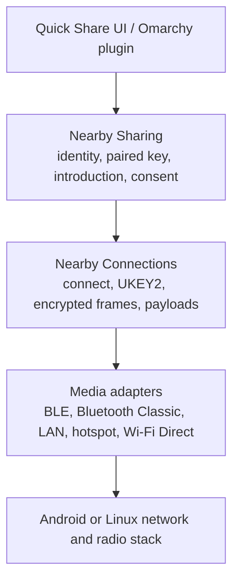

# Quick Share interoperability architecture and plan

Research date: 2026-09-04

## Decision

Do not add a notification or PIN-entry mechanism. Stock Android Quick Share starts
its receive prompt from the protocol exchange. The four-digit value is derived
from the UKEY2 authentication token and is compared on both devices; it is not
entered on the phone.

The 2026-09-04 physical-phone runs are a historical baseline. In both
directions, that daemon completed discovery, a same-LAN TCP connection, and
Connections/UKEY2, then disconnected inside the account-free paired-key
exchange before introduction or consent.

The latest physical run used `b45235f` and superseded the earlier
`invalid_payload` diagnosis. In its auto-accept sequence, acceptance occurred
after 108 ms and disconnection followed 58 ms later. None of 20 attempts
completed. The evidence does not establish the disconnect origin or reveal the
proprietary peer's internal reason, so no phone fix is claimed.

The newer diagnostic instrumentation has since been exercised with the actual
daemon and the pinned Google-derived Linux peer. A 1,048,577-byte `FILE`
completed in both directions with matching integrity. Its logs preserved
`connection_id` correlation before assigning each `share_id`. That is
reference-peer evidence, not a stock Android result. The instrumented build
still awaits its next physical-phone run.

This document complements the broader
[implementation baseline](research/implementation-baseline-2026-09.md),
[programmatic verification policy](research/bidirectional-programmatic-verification.md),
and [source-backed payload lifecycle audit](research/simulator-vs-android-paired-key.md).

## Scope and evidence rules

The target is local, account-free Quick Share in `Everyone` or explicit
`Receive` mode. Google-account trust, Contacts, Your devices, QR cloud sharing,
AirDrop interoperability, and NFC are separate protocols or trust modes.

Claims below use three evidence classes:

- **Public guarantee**: documented Android user behavior.
- **Reference behavior**: behavior in Google's pinned Apache-2.0 Nearby source.
  It is authoritative for the open implementation but is not a compatibility
  contract for the proprietary Android product.
- **Observed here**: current source, tests, or journal output from this machine.

Anything about the proprietary Android implementation beyond its documented UI
is unknown unless a black-box run establishes it.

## Canonical architecture

Quick Share is not one protocol. Nearby Sharing supplies advertisements,
trust/verification, attachment descriptions, consent, and transfer state.
Nearby Connections supplies endpoint connection, UKEY2, the encrypted D2D
channel, payload framing, keepalives, disconnects, and bandwidth upgrades.
Linux media adapters supply discovery and sockets.



The interfaces must remain layered:

1. The plugin issues local control commands and renders typed daemon state. It
   must not implement phone signaling or protocol timing.
2. The Sharing module owns the ordered sharing state machine.
3. The Connections module owns connection negotiation, UKEY2, encryption, and
   payload events.
4. Media adapters own only discovery, socket establishment, upgrade, fallback,
   and cleanup.

This is a deep-module split: protocol complexity remains behind the Sharing and
Connections interfaces instead of leaking into the plugin or platform adapters.

## Canonical account-free flow

| Stage                      | Sender                                                                                                                                                                                                                                                                                                                  | Receiver                                                                                                                                                                                            | Evidence                                                                                                                                                                                            |
| -------------------------- | ----------------------------------------------------------------------------------------------------------------------------------------------------------------------------------------------------------------------------------------------------------------------------------------------------------------------- | --------------------------------------------------------------------------------------------------------------------------------------------------------------------------------------------------- | --------------------------------------------------------------------------------------------------------------------------------------------------------------------------------------------------- |
| 1. Discovery/advertising   | Enters the share flow and searches for eligible endpoints.                                                                                                                                                                                                                                                              | Becomes publicly visible by opening `Receive` or selecting `Everyone for 10 minutes`. Only the receiving target needs public visibility for an account-free transfer.                               | Android Help says a missing target should be put in Receive mode and that Receive mode is visible to anyone nearby. Google's `Advertisement` includes a public device name for Everyone visibility. |
| 2. Endpoint connection     | Selects the advertised endpoint and opens the chosen medium.                                                                                                                                                                                                                                                            | Accepts the incoming Nearby Connections request.                                                                                                                                                    | Google Nearby `Core` and `NearbyConnectionsManagerImpl`.                                                                                                                                            |
| 3. Connections handshake   | Sends the connection request and takes the UKEY2 initiator role.                                                                                                                                                                                                                                                        | Answers the request and takes the UKEY2 responder role.                                                                                                                                             | Google `EncryptionRunner`; project implementation baseline, lines 108-134.                                                                                                                          |
| 4. UKEY2 secure channel    | Completes `CLIENT_INIT`, `SERVER_INIT`, and `CLIENT_FINISH`; derives directional keys and the raw authentication token.                                                                                                                                                                                                 | Completes the inverse role and derives the same authentication token.                                                                                                                               | Google `EncryptionRunner` and pinned `google/ukey2`.                                                                                                                                                |
| 5. Paired-key verification | Always calls `SendPairedKeyEncryptionFrame()`, then receives the peer frame, sends `PAIRED_KEY_RESULT`, and receives the peer result. Without an account certificate, Google still sends the paired-key frame using random signature and secret-ID-hash fallbacks, then reports `UNABLE`; it never skips this exchange. | Performs the same mandatory four-step exchange. Only the endpoint receiving the transfer needs public visibility; hidden/non-Everyone receiver policy may convert account-free `UNABLE` to failure. | Google `PairedKeyVerificationRunner::Run`, `SendPairedKeyEncryptionFrame`, `OnReadPairedKeyEncryptionFrame`, and `SendPairedKeyResultFrame`.                                                        |
| 6. Code comparison         | Exposes the four-digit value derived from the UKEY2 token.                                                                                                                                                                                                                                                              | Displays the same value when the product UI asks for verification. Users compare it; nobody types it.                                                                                               | Google Connections calls it a "4-digit authentication code shown to user". The exact stock Android presentation is proprietary and must be observed.                                                |
| 7. Sharing introduction    | Sends one `INTRODUCTION` containing attachment metadata and Connections payload IDs.                                                                                                                                                                                                                                    | Parses and validates the introduction before showing the incoming-share prompt.                                                                                                                     | Google Sharing wire schema and session implementations.                                                                                                                                             |
| 8. Receiver consent        | Waits.                                                                                                                                                                                                                                                                                                                  | Shows the incoming content and sender, then returns `ACCEPT`, `REJECT`, `NOT_ENOUGH_SPACE`, `UNSUPPORTED_ATTACHMENT_TYPE`, or `TIMED_OUT`.                                                          | Android Help says to wait for the receiver and tap Accept or Decline; Google Sharing wire schema defines the response statuses.                                                                     |
| 9. Payload transfer        | Sends referenced `BYTES`, `FILE`, or `STREAM` payloads after acceptance.                                                                                                                                                                                                                                                | Receives the payloads, reports progress, and validates completion.                                                                                                                                  | Google Connections payload schema and Sharing sessions.                                                                                                                                             |
| 10. Terminal outcome       | Reports completion, cancellation, or failure and cleans up.                                                                                                                                                                                                                                                             | Reports the same outcome and commits or removes received data.                                                                                                                                      | Google Connections payload callbacks and Sharing session state. There is not necessarily a separate Sharing "success frame" after every payload.                                                    |

The high-level sequence is:

```mermaid
sequenceDiagram
    participant S as Sender
    participant C as Nearby Connections
    participant R as Receiver

    R-->>S: Public endpoint advertisement
    S->>R: Endpoint connection request
    S->>C: UKEY2 CLIENT_INIT
    C-->>S: SERVER_INIT
    S->>C: CLIENT_FINISH
    Note over S,R: Encrypted D2D channel and shared 4-digit code
    S->>R: PAIRED_KEY_ENCRYPTION
    R-->>S: PAIRED_KEY_ENCRYPTION
    S->>R: PAIRED_KEY_RESULT
    R-->>S: PAIRED_KEY_RESULT
    S->>R: INTRODUCTION
    Note over S,R: Users compare the code; receiver reviews content
    R-->>S: ACCEPT or terminal refusal
    S->>R: Referenced payloads
    Note over S,R: Progress, completion, cancellation, and cleanup
```

## Current implementation

### Runtime module map

| Layer              | Current module                                                                    | Current responsibility                                                                                                              |
| ------------------ | --------------------------------------------------------------------------------- | ----------------------------------------------------------------------------------------------------------------------------------- |
| Plugin/control     | `packaging/omarchy-plugin`, `quickshare-control`, `crates/app/src/cli`            | Queues attachments, chooses a peer, opens receive visibility, accepts/rejects inbound offers, and renders `EndpointSnapshot`.       |
| Daemon coordinator | `crates/app/src/daemon` and `crates/core/sharing/src/coordinator.rs`              | Owns one active transfer, discovery/visibility leases, transfer phases, cancellation, and terminal state.                           |
| Sharing            | `crates/core/sharing/src/protocol`                                                | Builds paired-key, introduction, response, text, URL, file, and cancellation frames; maps Connections events into sharing outcomes. |
| Connections        | `crates/core/connections/src/session`                                             | Performs connection request/response, UKEY2, D2D encryption, byte/file payload framing, keepalives, disconnect, and upgrades.       |
| Crypto             | `crates/core/crypto`                                                              | Implements UKEY2 and the secure D2D channel.                                                                                        |
| Media              | `crates/app/src/daemon/media`, `crates/platform/network`, `crates/platform/bluez` | Selects LAN/Bluetooth routes, opens sockets, publishes/browses DNS-SD, and negotiates upgrades.                                     |

### Outbound ordering

`crates/app/src/daemon/network/transfer.rs::send_on_connection` currently:

1. completes `connect_route` and any bandwidth-upgrade attempt;
2. creates `SharingSession` from the encrypted Connections relationship;
3. emits `NetworkEvent::OutboundPairing`, which makes the plugin report
   `AwaitingPeerConsent` and expose the code;
4. calls `exchange_account_free_pairing`;
5. sends the attachment introduction;
6. waits for the phone's response;
7. emits `OutboundAccepted` and sends payload bytes.

Step 3 is semantically early. At that point the phone has not completed
paired-key verification and has not received an introduction. The plugin can
therefore claim that the phone is awaiting consent when no Android prompt can
exist yet.

### Inbound ordering

`crates/app/src/daemon/network/inbound.rs::receive_share_result` currently:

1. accepts the Connections/UKEY2 relationship and any upgrade;
2. calls `exchange_account_free_pairing`;
3. receives and validates the introduction;
4. emits `InboundOffered` with the verification code;
5. waits for the local Accept or Reject command;
6. returns the response and receives the payload.

The inbound UI ordering is correct: no local consent screen is emitted before
pairing and introduction. The pre-`b45235f` phone-to-laptop runs reached local
consent and then failed during step 6 with `invalid_payload` in
`payload_transfer`. The newer auto-accept run is the current physical evidence.

## Physical-device evidence

### Historical baseline from 2026-09-04

The 2026-09-04 user-service journal recorded:

- three laptop-to-phone attempts selecting `wifi_lan`, followed about 15 seconds
  later by `network::transfer` reporting `stage="handshake"` and
  `error_class="disconnected"`;
- two phone-to-laptop attempts after receive visibility opened, followed by
  `network::inbound` reporting the same stage and error;
- no introduction, receiver-consent, payload-progress, or completion event in
  either direction.

Those logs localized that baseline to
`SharingSession::exchange_account_free_pairing`, after Connections/UKEY2. They
did not identify which paired-key operation failed. This remains useful
historical evidence, but it is not the current diagnosis.

### Latest completed run before `b45235f`

- Pairing completed in both transfer directions.
- Outbound attempts 01 and 03 succeeded on the phone.
- Outbound attempt 02 ended with a phone error while the daemon reported local
  completion.
- Inbound attempts passed consent, then repeatedly returned `invalid_payload`
  during `payload_transfer`.
- The third inbound phone observation was ambiguous because the result appeared
  only after a delay.

That run moved the observed inbound boundary past pairing and consent into
payload transfer. It also exposed a terminal-outcome disagreement on one
outbound attempt without identifying the exact inbound rejection branch.

At that point, commit `b45235f` had been installed with the source-backed
lifecycle corrections documented in the
[payload lifecycle audit](research/simulator-vs-android-paired-key.md), but no
physical run had tested it. Neither the inbound failure nor the outbound result
disagreement could then be called fixed.

### Newest physical run on `b45235f`

- The auto-accept sequence ran 20 attempts and completed 0.
- Acceptance was observed after 108 ms. Disconnection followed 58 ms later.
- The available evidence did not establish the disconnect origin or expose the
  proprietary peer's internal reason.

This run supersedes `invalid_payload` as the newest observed failure, but it
does not explain the failure and does not demonstrate a phone fix.

### Diagnostic reference run

After the physical run, the instrumented daemon transferred a 1,048,577-byte
`FILE` with the pinned Google-derived Linux peer in both directions over LAN.
Both directions passed exact integrity checks in the temporary harness. The
logs also preserved the connection-to-share chronology: `connection_id`
correlated the exchange before `share_id` was assigned. The run verifies the
new observability on a live reference exchange. It does not establish stock
Android compatibility, and the instrumented build still needs a physical-phone
test.

## Why the simulations pass

The tests are useful, but their claims are narrower than physical Android
interoperability.

| Test layer                     | What it proves                                                                                                                                                                                          | Why it does not settle current-phone behavior                                                                                                                                                                                                            |
| ------------------------------ | ------------------------------------------------------------------------------------------------------------------------------------------------------------------------------------------------------- | -------------------------------------------------------------------------------------------------------------------------------------------------------------------------------------------------------------------------------------------------------- |
| Rust unit and stream loopbacks | Rust initiator and responder agree on UKEY2, pairing, introductions, consent, payloads, and failures.                                                                                                   | Both ends share the same implementation and assumptions. A symmetric protocol error can pass.                                                                                                                                                            |
| Google UKEY2 oracle            | Rust and Google's standalone UKEY2 implementation derive compatible tokens and encrypt/decrypt in both roles.                                                                                           | It stops below Nearby Connections framing and the paired-key Sharing exchange. The journal indicates UKEY2 already succeeds.                                                                                                                             |
| Google Sharing fixtures        | Google-generated introduction and response protobufs decode to the expected semantics.                                                                                                                  | `tools/oracle/sharing-fixtures` uses `FakeNearbyConnectionsManager`, begins after connection setup, canonicalizes payload IDs, and does not execute discovery, UKEY2, paired-key exchange, or Android policy.                                            |
| `make test-rust-lan`           | The Rust daemon and the pinned Google-derived Linux `nearby_sharing_cli` complete a same-LAN file transfer in both directions with matching SHA-256. This does exercise the live account-free exchange. | The peer is an experimental Linux fork in a controlled container, configured to auto-accept. It is not stock Android, has fixed version/configuration, covers files only, and may accept sequences or fields that the current proprietary phone rejects. |
| `make test-diverse-lan`        | NearShare and the Google-derived Linux peer interoperate over isolated LAN in both directions.                                                                                                          | The Rust daemon is not one of the peers. This validates the lab and reference diversity, not this product.                                                                                                                                               |
| Android Nearby probe           | Google Play services `ConnectionsClient` can advertise, discover, connect, compare authentication digits, and exchange a payload in emulator roles.                                                     | It tests generic Nearby Connections, not stock Quick Share's paired-key, introduction, consent, or UI behavior.                                                                                                                                          |
| Stock Quick Share AVD plan     | The documented plan would exercise the proprietary product through UI Automator.                                                                                                                        | No admitted bidirectional stock Quick Share AVD-to-Rust gate currently closes this gap. `make test-android-nearby` remains experimental, not compatibility evidence.                                                                                     |

The critical mismatch is therefore not "simulation versus hardware" in
general. It is the remaining gap between Google-derived or open peers,
lower-layer probes, and the current stock Android Quick Share product. The
newest phone run ends shortly after acceptance, with no known disconnect
origin.

## Evidence-backed gaps

### Confirmed gaps

1. The newest physical auto-accept sequence completed 0 of 20 attempts.
   Acceptance occurred after 108 ms and disconnection followed 58 ms later,
   but the disconnect origin remains unknown.
2. The proprietary peer did not provide an internal failure reason. Local
   diagnostics cannot reconstruct a reason the peer did not send.
3. One earlier outbound attempt produced a phone error after the daemon
   reported local completion. The newest run does not show that disagreement
   fixed.
4. The Google fixture corpus covers introduction/response semantics but not a
   role-complete paired-key transcript generated by Google's runner.
5. The live Linux reference test proves one peer implementation and file
   transfers, not current stock Android policy or protocol drift.
6. The Android probe stops at Nearby Connections and cannot validate Quick
   Share Sharing or its UI.
7. No admitted black-box stock Quick Share test covers Android sender and
   receiver roles against the Rust daemon.
8. The new diagnostic instrumentation has passed the bidirectional reference
   `FILE` run but has not yet been exercised in another physical-phone run.

### Not yet proven

The current evidence does not identify which side initiated the newest
disconnect or which proprietary validation or policy branch caused it. The
108 ms acceptance and 58 ms post-acceptance interval narrow the timing, not the
cause. Debug fields can report a local operation, outcome, reason,
`io_error_kind`, or `disconnect_origin` when the daemon knows them. They cannot
reveal an internal peer reason that never crosses the wire.

The 1,048,577-byte reference `FILE` run proves bidirectional integrity and
connection-to-share correlation for that Google-derived Linux peer. It does
not prove the current phone fixed, settle the earlier phone-versus-daemon
outcome disagreement, or certify arbitrary peers and transports.

## Original staged implementation plan

This plan records the investigation sequence written from the 2026-09-04
paired-key baseline. The later physical run showed pairing completing in both
directions, so phases 1 through 3 do not describe the active failure boundary.
Keep them as the rationale for the earlier investigation, not as a claim that
pairing still fails. The immediate work now starts with physical validation of
the installed lifecycle changes.

### Phase 1: make the failure diagnosable

#### Change

- Split paired-key execution into named operations:
  `send_encryption`, `receive_encryption`, `send_result`, and `receive_result`.
- Return a typed pairing outcome containing only status and peer OS type. Preserve
  role, expected frame kind, and failure class in errors.
- Log stage name, direction, elapsed time, received frame kind, and result enum.
  Never log authentication tokens, verification codes, signatures, hashes,
  endpoint metadata, filenames, text, URLs, or payload contents.
- Keep outbound state `connecting` through paired-key exchange. Enter
  `awaiting_peer_consent` only after the introduction has been sent. Change the
  copy to "Compare this code on both devices, then accept on the receiving
  device." Never instruct the user to enter a PIN.

#### Proof

- Add deterministic scripted-peer cases for disconnect/timeout/unexpected frame
  at each of the four operations.
- Re-run one user-authorized transfer in each direction. The log must identify
  the last successful operation and next received event without private data.

#### Exit criterion

A physical run gives a specific wire-state mismatch rather than generic
`handshake/disconnected`.

### Phase 2: add an independent paired-key oracle

#### Change

- Extend the pinned Google fixture/oracle tooling around
  `PairedKeyVerificationRunner`, not `FakeNearbyConnectionsManager` alone.
- Generate separate sender and receiver cases. In each case, put only the peer
  acting as the transfer receiver in account-free Everyone visibility. Cover
  the encryption frame, result frame, `UNABLE` combination, explicit `FAIL`,
  timeout, and wrong-frame cases. Record ordered decoded fields and states, not
  random raw bytes.
- Extend the live Google-derived peer wrapper to report privacy-safe paired-key
  substages so `make test-rust-lan-{outbound,inbound}` proves the exact path it
  exercised.

#### Proof

- The Google runner accepts Rust in both roles.
- Rust accepts Google in both roles.
- The same scenario corpus runs against the scripted adapter and the live
  reference adapter.

#### Exit criterion

The repository has a red test reproducing the physical substage or a canonical
Google behavior that the current Rust runner violates.

### Phase 3: align the Sharing state machine

#### Change

- Replace the permissive shared `decode_pairing` helper with stage-specific
  decoding for `PAIRED_KEY_ENCRYPTION` and `PAIRED_KEY_RESULT`.
- Model Google's combined result rules explicitly: `FAIL` is terminal;
  account-free `UNABLE` may continue only under the supported public-visibility
  policy; successful certificate trust remains out of scope.
- Preserve and test peer OS type, keepalive/upgrade interleaving, deadlines, and
  role-specific behavior established by the oracle and physical trace.
- Apply only the concrete field, ordering, or policy correction demonstrated by
  Phase 1 or Phase 2. Do not add Android-specific magic values without a source
  or black-box comparison.

#### Proof

- First make the new oracle/trace case fail on the old code.
- Implement the smallest correction and make that case pass.
- Keep Rust loopbacks, Google UKEY2 interop, Sharing fixtures, and both live LAN
  directions green.

#### Exit criterion

Both directions pass the independent pairing oracle and reach introduction with
stage-correct daemon state.

### Phase 4: add stock Android black-box coverage

#### Change

- Use a pinned Google Play AVD, Mobly, and UI Automator as already designed in
  the bidirectional verification document.
- Require an AVD-to-AVD Quick Share control in both directions before using the
  image to judge Rust.
- Run Android-to-Rust and Rust-to-Android through the same-LAN bridge. Capture
  UI hierarchy, screenshots, privacy-safe daemon stages, logcat, and packet
  timing on failure.
- Keep the public `ConnectionsClient` probe as a lower-layer diagnostic; do not
  count it as a Quick Share test.

#### Proof

- Stock Quick Share discovers the Rust endpoint, shows matching verification,
  accepts/rejects, transfers exact bytes, and performs a clean repeat in both
  directions.

#### Exit criterion

Admit the gate only after repeatable controls and cross-peer runs. If the AVD
cannot bridge to Linux through documented mechanisms, preserve the failure and
keep physical-phone verification as the product gate.

### Phase 5: physical-device acceptance

Record phone model, Android build, Google Play services version, Quick Share
version where exposed, visibility mode, selected route, and daemon build. Then
run on the same phone:

1. laptop sends a file while the phone is in `Receive` or `Everyone for 10
minutes`; compare the four digits, accept, and compare SHA-256;
2. phone sends a file while laptop visibility is open; compare the digits,
   accept in the plugin, and compare SHA-256;
3. repeat both directions to catch leaked state;
4. repeat plain text and URL in both directions;
5. exercise reject and timeout without leaving an active share, socket, partial
   file, advertisement, or visibility lease.

A physical transfer is green only when discovery, paired-key verification,
matching code, introduction, explicit consent, exact payload, terminal outcome,
and cleanup are all observed. Seeing a peer or reaching a consent-looking local
screen is insufficient.

## Current change order

1. **Now:** run the instrumented build against the physical phone and correlate
   events by `connection_id`, then `share_id` once assigned.
2. **Next:** record the privacy-safe terminal outcome and any available
   `io_error_kind` or `disconnect_origin`. Do not infer a proprietary peer's
   internal reason from a generic disconnect.
3. **Then:** change wire behavior only if the physical evidence identifies a
   concrete rejected frame, validation branch, or terminal-state mismatch.
4. **Before compatibility claims:** complete the Phase 4 stock Android gate or
   document why it cannot run, and complete Phase 5 physical acceptance.
5. **After same-LAN transfer is verified on the phone:** broaden Bluetooth,
   hotspot, Wi-Fi Direct, OEM, and Android-version coverage. The successful
   reference-peer `FILE` run does not certify those paths.

## Primary sources

- [Android Help: Use Quick Share on your Android device](https://support.google.com/android/answer/9286773?hl=en)
  documents Send, Receive, receiver Accept/Decline, screen-unlocked behavior,
  and `Everyone for 10 minutes`.
- [Google Nearby `Advertisement`](https://github.com/google/nearby/blob/588531995decf09500870ed4d2e1ac6740a3e338/sharing/advertisement.h)
  and
  [`Advertisement::ToEndpointInfo`](https://github.com/google/nearby/blob/588531995decf09500870ed4d2e1ac6740a3e338/sharing/advertisement.cc#L160-L295)
  define public endpoint information and Everyone-visible device names.
- [Google Nearby `NearbyConnectionsManagerImpl`](https://github.com/google/nearby/blob/588531995decf09500870ed4d2e1ac6740a3e338/sharing/nearby_connections_manager_impl.cc#L56-L317)
  defines the Sharing wrapper's service ID, strategies, and connection options.
- [Google Nearby `EncryptionRunner`](https://github.com/google/nearby/blob/588531995decf09500870ed4d2e1ac6740a3e338/connections/implementation/encryption_runner.cc#L38-L190)
  implements the UKEY2 connection handshake.
- [Google UKEY2](https://github.com/google/ukey2/tree/10fc737aa901e873a3367e7e26b88eb01cd55d69)
  owns the cryptographic handshake and D2D channel behavior.
- [Google `PairedKeyVerificationRunner`](https://github.com/google/nearby/blob/588531995decf09500870ed4d2e1ac6740a3e338/sharing/paired_key_verification_runner.cc#L114-L373)
  defines paired-key ordering, account-free random stand-ins, visibility policy,
  and result combination.
- [Google Connections authentication digits](https://github.com/google/nearby/blob/588531995decf09500870ed4d2e1ac6740a3e338/connections/v3/connection_result.h#L30-L38)
  describes the four-digit value derived from UKEY2.
- [Google Sharing wire schema](https://github.com/google/nearby/blob/588531995decf09500870ed4d2e1ac6740a3e338/sharing/proto/wire_format.proto)
  defines paired-key, introduction, response, and attachment frames.
- [Google Connections payload schema](https://github.com/google/nearby/blob/588531995decf09500870ed4d2e1ac6740a3e338/connections/implementation/proto/offline_wire_formats.proto#L163-L219)
  defines payload headers and data frames.
- [Pinned Google-derived Linux peer](https://github.com/kidfromjupiter/nearby/tree/6887b0983200c6c8c29e614ea2633d13bf18315d)
  is live reference evidence, not a Google-supported Linux product or stock
  Android compatibility contract.
